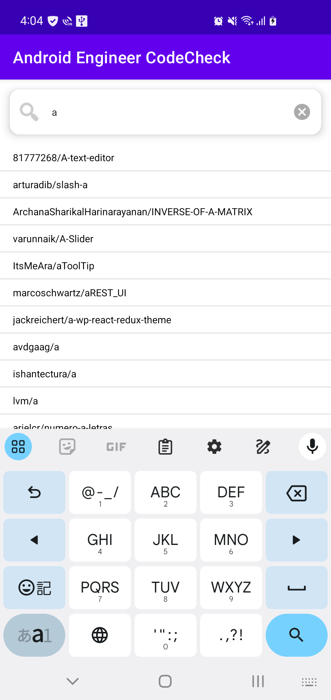
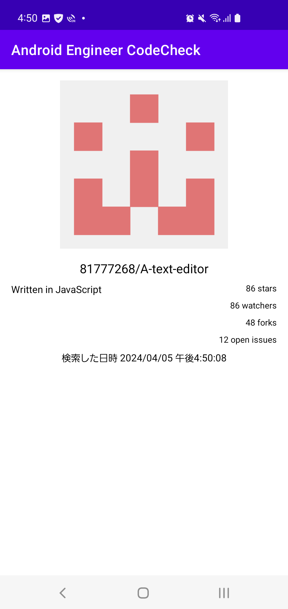

# 株式会社ゆめみ Android エンジニアコードチェック課題

## 概要

本プロジェクトは株式会社ゆめみ様のandroid開発者採用へ応募して、提出することになった課題である。

## アプリ仕様

本アプリは`GitHub` のリポジトリを検索するアプリである。

### 環境

- IDE：Android Studio Iguana | 2023.2.1 Patch 1
- Kotlin：1.6.21
- Java：17
- Gradle：8.0
- minSdk：23
- targetSdk：31

### 画面構成

このアプリは検索画面と詳細画面によって構成される。

#### 検索画面（検索前）

#### 検索画面（検索後）

#### 詳細画面

### 動作

1. 検索画面において、何かしらのキーワードを入力する
2. GitHub API（`search/repositories`）でリポジトリを検索し、結果一覧を概要（リポジトリ名）で表示する
3. 特定の結果を選択したら、詳細画面へ遷移する
4. 詳細画面では、選択したリポジトリの詳細（リポジトリ名、オーナーアイコン、プロジェクト言語、Star数、Watcher数、Fork数、Issue数）を表示する
