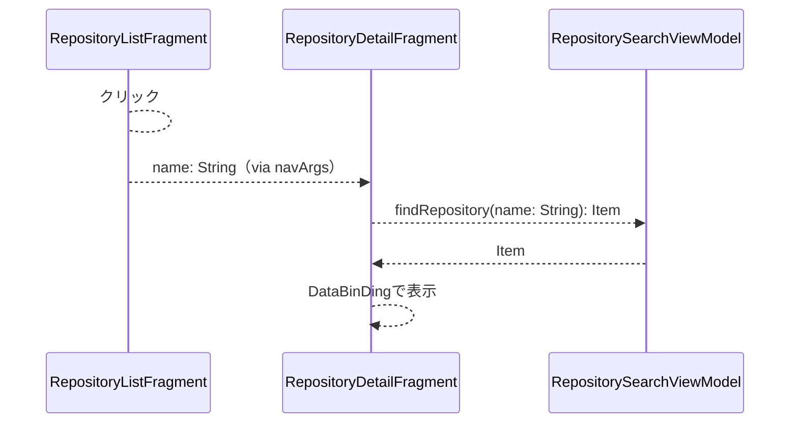

# 株式会社ゆめみ Android エンジニアコードチェック課題

## 概要

本プロジェクトは株式会社ゆめみ様のandroid開発者採用の提出課題である。

## アプリ仕様

本アプリは`GitHub` のリポジトリを検索するアプリである。


### 環境

- IDE：Android Studio Iguana | 2023.2.1 Patch 1
- Kotlin：1.9.23
- Java：17
- Gradle：8.4
- minSdk：23
- targetSdk：34

### ライブラリ

- Hilt: 2.50
- Ktor: 2.3.9
- Coil: 2.6.0
  
### テスト関連ライブラリ

- Mockito-kotlin: 5.2.1
- Espresso: 3.5.1

### 画面構成

このアプリは検索画面と詳細画面によって構成される。

#### 検索画面（検索前）


#### 検索画面（検索後）


#### 詳細画面


### 動作

1. 検索画面において、何かしらのキーワードを入力する
2. GitHub API（`search/repositories`）でリポジトリを検索し、結果一覧を概要（リポジトリ名）で表示する
3. 特定の結果を選択したら、詳細画面へ遷移する
4. 詳細画面では、選択したリポジトリの詳細（リポジトリ名、オーナーアイコン、プロジェクト言語、Star数、Watcher数、Fork数、Issue数）を表示する

### アプリの構造とクラスの概説

#### 構造

MVVM構造を採用した

#### View

- NavHostActivity  
  このアプリにおける、唯一の`Activity`  
  画面全体で`NavHostFragment`を表示する
- SearchBarAndRepositoryListFragment  
  検索画面を表示する`Fragment`  
  検索バー部分とリスト部分がそれぞれ`Fragment`になっている  
  両者を表示するコンテナーの役割を`SearchBarAndRepositoryListFragment`が担う
  - SearchBarFragment  
    検索キーを入力する`Fragment`  
    検索キーを``RepositorySearchViewModel#searchRepository`へ渡す
  - RepositoryListFragment  
    リポジトリの名前をリスト表示する`Fragment`  
    リスト部分は`RecyclerView`を使用している  
    リストの各アイテムの表示には`DataBinding`を使用している
    アイテムをクリックしたとき、`navArgs`としてname(String)を渡す
- RepositoryDetailFragment  
  詳細画面を表示する`Fragment`  
  `navArgs`から取り出した文字列をキーに、`RepositorySearchViewModel`からデータを引き出して表示する  
  データの表示には`DataBinding`を使用している

#### ViewModel

- RepositorySearchViewModel  
  2つの機能がある  
  1. `RepositorySearchDataSource#searchRepository()`を実行して、リポジトリのリストを取得する
  2. StateFlowを用いて、リポジトリのリストをViewへ伝える

#### Model

- RepositorySearchDataSource
  検索を実行し、検索結果のListを作成して返す  
  通信にはKtorを使い、`kotlinx-serialization`を用いてdata objectに変換する

### データの流れ

  ```mermaid
    flowchart TD
    RepositorySearchDataSource -- ItemのList --> RepositorySearchViewModel
    RepositorySearchViewModel -- StateFlow --> RepositoryListFragment
    RepositoryListFragment --name:String--> RecycleViewの各行
  ```

- `RepositoryListFragment`は`RepositorySearchViewModel`から`List`の`name`を各リストアイテムへ渡す  
クリック時は`navArgs`をして`name`を渡す
- `RepositoryListFragment`は`navArgs`から取り出した文字列をキーに、`RepositorySearchViewModel`からデータを取得し、表示する  
  表示には`DataBinding`を使用している

 ### クリック時の動作の図解



## テスト

### test/viewModel/RepositorySearchViewModelTest.kt

SearchViewModel#searchRepository()を実行して、状態を確認する。

- searchRepository()に渡した文字列がRepositorySearchDataSource#searchRepositoryに渡ったことを確認する
- RepositorySearchDataSourceから通知されたListがFlowに格納されていることを確認する

### androidTest/view/RunThroughTest.kt

フェイクのRepositorySearchDataSourceを注入した上でアクティビティを起動し、通信を模倣してUI状態を確認する。

- このテストはespressoのテストである

## 未着手の問題点

- 遷移のアニメーションを、もう少し格好の良いものにしたかった
- UIの刷新は手付かずで終わった
- 同じ文字列で再検索した時、画面の変化がないけれど、何か警告を出す方が良いかもしれない
- 詳細画面からスワイプで検索画面へ戻れると良さそう